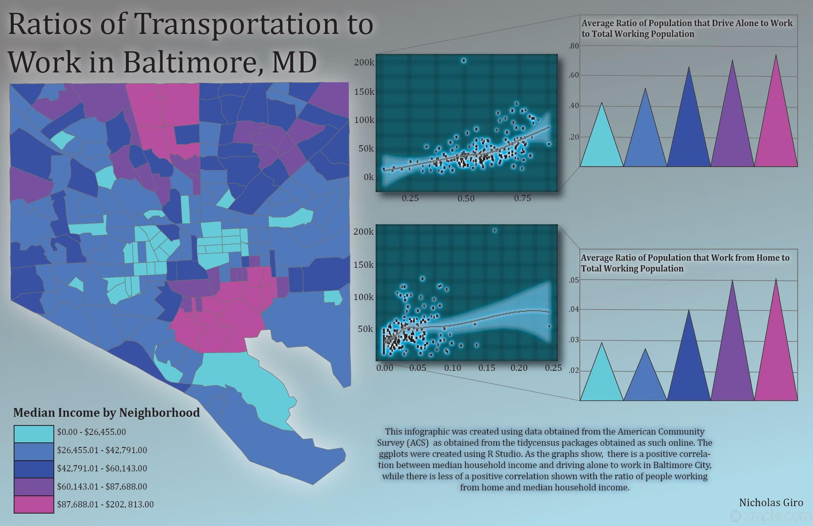
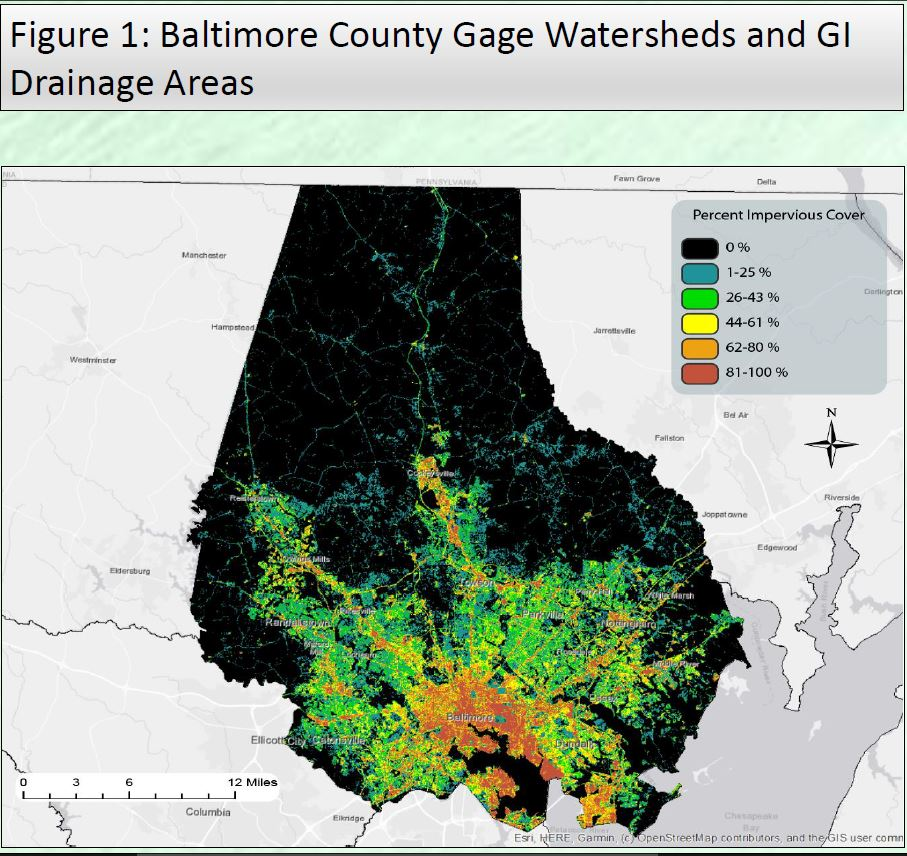

## My Portfolio

---

### Previous GIS Projects 

[**Methods of Transportation to Work in Baltimore, MD**](https://github.com/ngiro1/ngiro1.github.io/blob/master/pdf/Giro_Lab4%20%5BRecovered%5D.pdf)

This infographic was created to show the differences in methods of transportation to work in correlation with median income for adults in the city of Baltimore, MD. RStudio, ArcMap, and Adobe Illustrator were utilized in creating this graphic.
  

[**Analyzing the Efficacy of Green Infrastructure**](https://github.com/ngiro1/ngiro1.github.io/blob/master/pdf/FinalPresentation.pdf)

This project utilized GIS hydrology tools to analyze just how well green infrastructure worked towards reducing peak flows in channels using the previous data presented by Pennino et al.
  

[**Where would Demogorgons Spawn in Baltimore, MD?**](/pdf/lab6_pt2_2complete_new3.pdf)

The class project infographic was entirely created using ArcGIS software. Using provided data regarding *Stranger Things*'s Demogorgons and their likely habitat spawning requirements, I created this ranked map showing the likely spawning locations in the city of Baltimore, MD.
  

---

### Category Name 2

- [Project 1 Title](http://example.com/)
- [Project 2 Title](http://example.com/)
- [Project 3 Title](http://example.com/)
- [Project 4 Title](http://example.com/)
- [Project 5 Title](http://example.com/)

---

---

Page template forked from <a href="https://github.com/evanca/quick-portfolio">evanca</a>

<!-- Remove above link if you don't want to attibute -->
