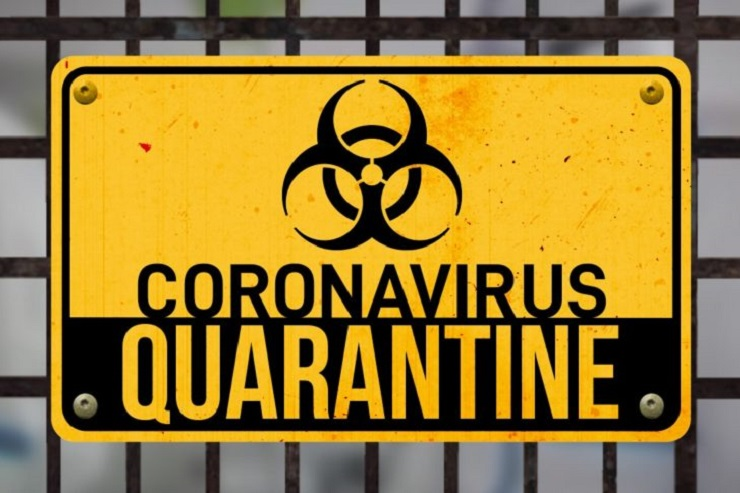
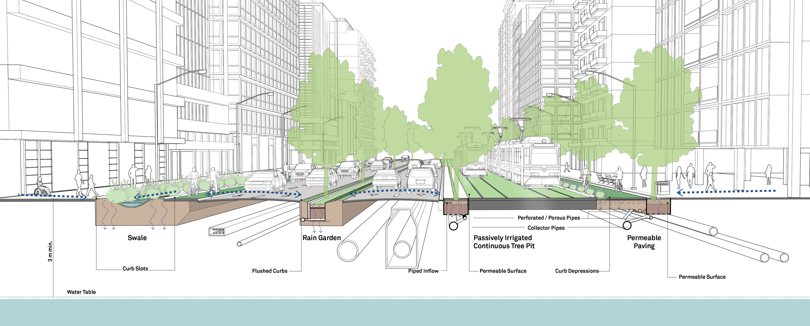

## My Portfolio

---

[**Can Twitter Predict the 2020 Election?**](/Projects/2020)

[**Comparing the Share of #StayHome vs #Covid19 Tweets Across the US**](/Projects/RTweet)

[**Tracking the Change in the Confirmed Cases of Covid19 in China**](/Projects/Project1_CoronaVirus)

[**Interpolation of the January 25, 2020, Storm in Harford County**](https://ngiro1.github.io/qgis2web_2020_02_18-15_04_48_049557/index.html)

### Previous GIS Projects 

[**Methods of Transportation to Work in Baltimore, MD**](/Projects/transportation)

  

[**Analyzing the Efficacy of Green Infrastructure**](/Projects/efficacy_of_green_infra)

  

[**Where would Demogorgons Spawn in Baltimore, MD?**](/Projects/demogorgon)

  

---

Page template forked from <a href="https://github.com/evanca/quick-portfolio">evanca</a>

<!-- Remove above link if you don't want to attibute -->
